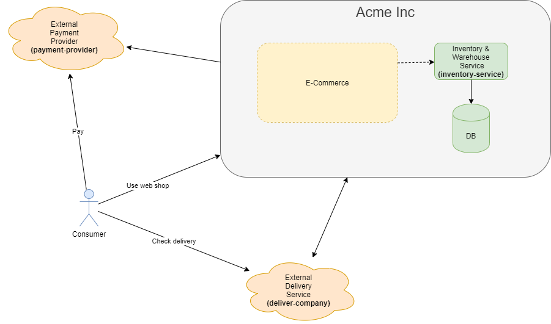

# Distributed Systems Excercise

## Task

Implement Frontend and Backend for e-commerce system.


#### User stories

* Customer needs to be able to 
  * View all avaialble products
  * Buy selected product
  * Pay purchase in __Payment provider's__ site
  * See purchase info after the purchase including _PurchaseId and DeliveryId_
  * Check delivery status from __Delivery Company's__ site

#### Existing services

We have legacy Inventory Service, that can be used, but it will be discarded in the near future. Rest of the services are external.

* __Inventory Service__: Product listing and stock data
* __Payment Provider (external)__: e.g. PayPayl, Bank, Klarna
* __Delivery Company (external)__: e.g. DHL, UPS, Posti

## Flow

* __Frontend__: Get items
* __Frontend__: Create order
  * __Backend__: Store order data
    * Create payment to _PaymentProvider_
      * Return Created to __frontend__ with id
* __Frontend__: Go to payment url
  * http://localhost:9080/?callbackUrl=hello&paymentId=abba
  * Callback should be back to Front
  * After the redirect call Backend
    * __Backend__: Handle paid order
      * Validate payment state is 1 from _PaymentProvider_
      * Send delivery request to _DeliveryCompany_
        * _DeliveryCompany_ will notify __Backend__ on pickup to url defined in _senderNotificationUrl_. (POST)
          * __Backend__ endpoint must return Ok to __Delivery Company__
        * _DeliveryComapny_ will notify _SMS Client_ after X seconds.
      * Return Delivery id to customer
        
    * NOTE: Packaging will process new orders in 10-30sec

## Services

Start:
```sh
docker-compose up
```

### Inventory Service

Has product data, stock quantity.

```
http://localhost:9040/

GET /inventory
GET /inventory/{id}
POST /inventory/inventory-change
```
### Payment Provider 

Payment Provider offers a payment solutions for e-commerces. 

```
http://localhost:9080/

GET /payment/{id}
POST /payment/create-payment
```

Payment page: `http://localhost:9080/`

### Delivery Company

Delivery Company TM 

```
http://localhost:9090

GET /delivery/{id}
POST /delivery
```

Sms client: `http://localhost:9090/smsclient.html`

## Request Examples

### Inventory Service

Get Products
```sh
curl http://localhost:9040/inventory
```

Get single product
```sh
curl http://localhost:9040/inventory/APL7
```

Inventory change 
```sh
curl --request POST \
  --url http://localhost:9040/inventory/inventory-change \
  --header 'content-type: application/json' \
  --data '{
	"id": "APL7",
	"changeAmount": -3
  }'
```

### Payment Provider

Create payment
```sh
curl --request POST \
  --url http://localhost:9080/payment/create-payment \
  --header 'content-type: application/json' \
  --data '{ "amount": 12345 }'
```

```json
{"id":"6aae","amount":12345,"creationTime":"2020-04-19T05:22:01.3481563+00:00","state":0}
```

Get payment
```sh
curl http://localhost:9080/payment/f084
```

### Delivery Company

Create delivery request
```sh
curl --request POST \
  --url http://localhost:9090/delivery \
  --header 'content-type: application/json' \
  --data '{
    "senderNotificationUrl": "http://host.docker.internal:80/delivery-notify/",
    "address": "test",
    "sms": "tt",
    "referenceId": "6aae"
  }'
```

```json
{"id":"fc881","currentStatus":"Created","creationDate":"2020-04-22T21:51:10.839758+00:00","senderNotificationUrl":"http://mybackend","receiverInfo":{"address":"test","sms":"tt","deliveryDate":"0001-01-01T00:00:00+00:00"},"events":[{"status":"Created","updateTime":"2020-04-22T21:51:10.84176+00:00"}]}
```

__NOTE:__ Check callback url from https://nickjanetakis.com/blog/docker-tip-65-get-your-docker-hosts-ip-address-from-in-a-container

`host.docker.internal` on Windows and macOS. Use `ip a` to check `docker0` inet ip.

Payload sent to callback url
```json
{ "id": "fc881", "referenceId": "6aae", "pickUpTime":"0001-01-01T00:00:00+00:00" }
```

Get delivery request
```sh
curl http://localhost:9090/delivery/fc881
```