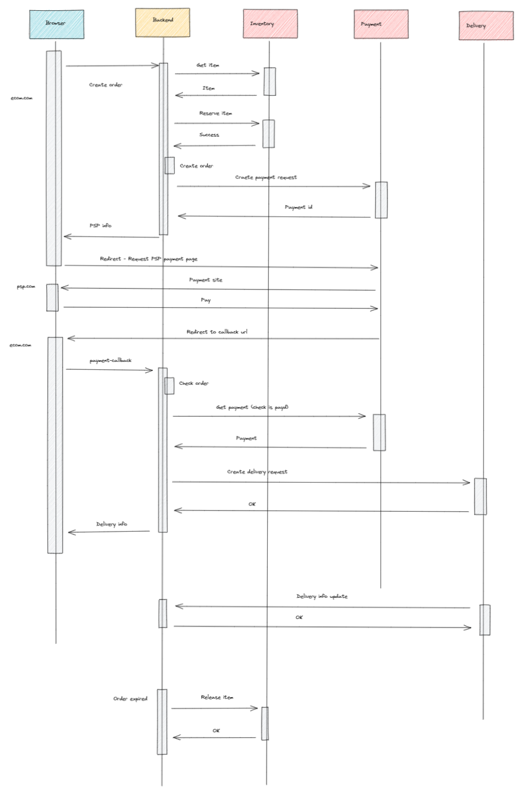
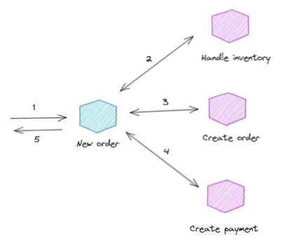
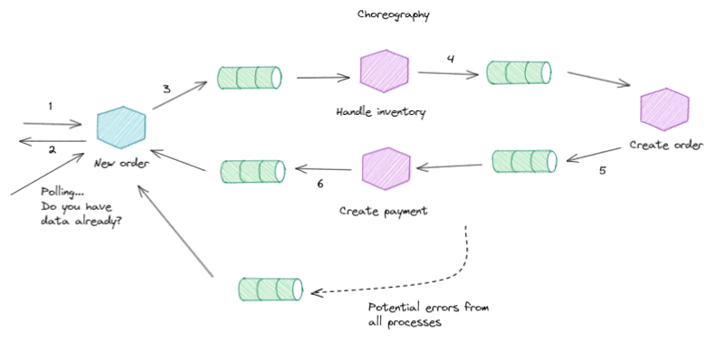
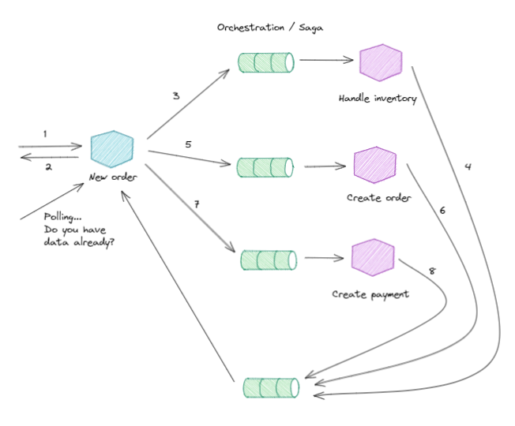

# Backend examples

## Synchronous

#### Sequence

#### Processes

## Event Driven

__TODO__

__Choreography vs Orchestration__

The choreography describes the interactions between multiple services, 
where as orchestration represents control from one party's perspective. 

This means that a choreography differs from an orchestration with respect 
to where the logic that controls the interactions between the services involved should reside.

### Choreography

### Orchestration / Saga

